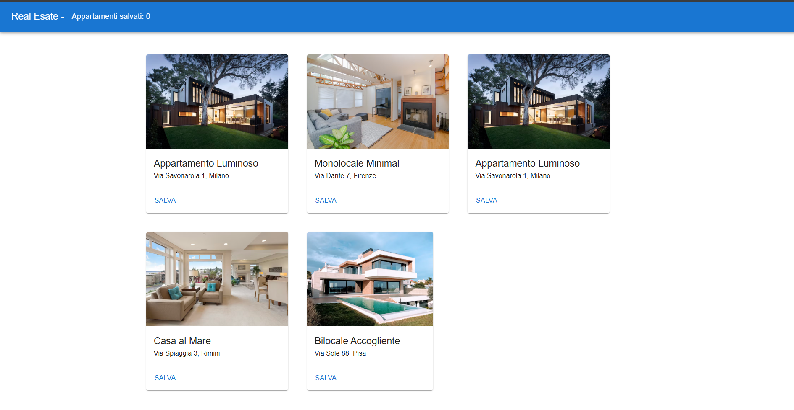

# 🏠 Real Estate Rental App

A modern **React-based web application** that simulates an apartment rental platform. Built with **Vite**, **Redux**, **Material UI**, and **React Router**, this app demonstrates key frontend development skills with clean design and interactive functionality.

---

## 📸 Preview


 
*(Replace with your screenshot if available)*

---

## 🚀 Features

- ✅ **View apartment listings** (20+ entries)
- ✅ **Preview with title, image, and address**
- ✅ **Detailed view** for each apartment
- ✅ **Save/remove favorites** with global state (Redux)
- ✅ **Favorites counter** in the navbar
- ✅ **Modern UI** using Material UI
- ✅ **Navigation** with React Router
- ✅ **State management** with Redux Toolkit
- ✅ **Fully tested** using Jest and React Testing Library

---

## 🧱 Tech Stack

| Technology | Description |
|------------|-------------|
| [React](https://reactjs.org/) | Frontend library |
| [Vite](https://vitejs.dev/) | Fast development server & bundler |
| [Material UI](https://mui.com/) | Modern component styling |
| [Redux Toolkit](https://redux-toolkit.js.org/) | State management |
| [React Router DOM](https://reactrouter.com/) | Routing |
| [Jest](https://jestjs.io/) + [Testing Library](https://testing-library.com/) | Unit and UI testing |

---

## 📁 Folder Structure

```
real-estate-rental/
├── public/
│   └── apartments.json        # Apartment data
├── src/
│   ├── components/            # Reusable UI components
│   ├── pages/                 # Route-level pages
│   ├── redux/                 # Redux state slices
│   ├── tests/                 # Unit tests
│   ├── App.jsx                # Main app shell
│   └── main.jsx               # Entry point
```

---

## 🛠️ Setup Instructions

### 1. Clone the repository

```bash
git clone https://github.com/your-username/real-estate-rental.git
cd real-estate-rental
```

### 2. Install dependencies

```bash
npm install
```

### 3. Run the development server

```bash
npm run dev
```

Open your browser at [http://localhost:5173](http://localhost:5173)

---

## 🧪 Run Tests

```bash
npm run test
```

To run in watch mode:
```bash
npm run test:watch
```

---

## 📦 Build for production

```bash
npm run build
```

---

## 📚 Future Enhancements

- 🔍 Search & filter by city or price
- ❤️ "Saved Apartments" page
- 💾 Persist favorites to localStorage or backend
- 📱 Mobile responsive layout

---

## 👨‍💻 Author

**Jean Jeacques**  
[GitHub](https://github.com/j-kassanova) · [LinkedIn](https://www.linkedin.com/in/your-profile/)  

---

## 📄 License

This project is licensed under the [MIT License](LICENSE).
